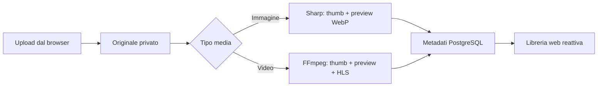

# Frameo

Frameo è un media manager privato, veloce e dockerizzabile per caricare, elaborare,
catalogare e riprodurre foto e video dal browser.

## Cosa include

- UI responsive per desktop, tablet e mobile
- upload drag-and-drop in streaming, senza tenere l'intero file in memoria
- thumbnail e preview WebP per le immagini tramite Sharp
- thumbnail, clip preview e playlist HLS per i video tramite FFmpeg
- streaming HTTP con supporto `Range` per seek e riproduzione progressiva
- PostgreSQL + Prisma per media, persone, tag, gruppi e job di elaborazione
- filtri avanzati combinabili per persone, tag, gruppi, date, durata, risoluzione,
  stato, preferiti, marker e duplicati
- marker temporali e player Highlights infinito sulla vista filtrata, con ritorno
  immediato al video sorgente
- Frame Lab per scorrere i video a passi di 1 o 10 fotogrammi, leggere timecode e
  FPS reali e salvare screenshot PNG alla risoluzione sorgente
- anteprima video automatica al passaggio del mouse
- rilevamento duplicati esatti SHA-256 e somiglianze visuali tramite dHash
- editor FFmpeg non distruttivo per tagliare, dividere e unire video
- utenti, ruoli e regole ALLOW/DENY per media, persone, tag e gruppi
- rinomina fisica e riorganizzazione sicura degli originali in cartelle reali
- catalogazione rapida, selezione multipla, ricerca e pannello dettagli
- modalità demo automatica quando non è configurato un database
- immagine Docker singola più PostgreSQL in Docker Compose

## Avvio rapido con Docker

```bash
docker compose up --build
```

Apri [http://localhost:3000](http://localhost:3000).

I file originali e derivati restano nel volume `frameo_media`; il database è nel
volume `frameo_postgres`.

## Sviluppo locale

Prerequisiti: Node 24+, PostgreSQL e FFmpeg disponibili nel `PATH`.

```bash
npm install
copy .env.example .env
npm run db:push
npm run db:seed
npm run dev
```

Per provare soltanto l'interfaccia senza PostgreSQL:

```bash
$env:DEMO_MODE="true"
npm run dev
```

## Pipeline media



Gli originali non vengono modificati. Ogni derivato è salvato in
`storage/derived/<media-id>` e può essere rigenerato senza perdita.

Gli screenshot estratti dai video diventano normali media della libreria: restano
collegati al video e al timecode sorgente, ereditano persone, tag e gruppi e
seguono quindi le stesse regole di visibilità.

Le operazioni dell'editor generano nuovi originali sotto `storage/edited`. Lo
spostamento fisico è invece intenzionalmente distruttivo sul vecchio path: richiede
la conferma testuale `SPOSTA`, verifica che i path restino nello storage gestito,
evita collisioni e ripristina il file se l'aggiornamento del database fallisce.

## Modello dati

- `MediaAsset`: originale, derivati, stato, metadati tecnici, FPS e relazione
  sorgente/screenshot
- `Person` / `MediaPerson`: persone e regioni facciali opzionali
- `Tag` / `MediaTag`: tassonomia libera many-to-many
- `Group` / `GroupMedia`: raccolte ordinate
- `ProcessingJob`: avanzamento, operazione ed eventuale errore
- `HighlightMarker`: intervalli temporali riproducibili nel feed Highlights
- `DuplicateMatch`: corrispondenze esatte o percettive e stato di revisione
- `AppUser` / `AccessRule`: ruoli e ACL con precedenza delle regole DENY
- `EditProject` / `EditSegment`: montaggi non distruttivi e sorgenti ordinate
- `FileOperation`: audit degli spostamenti, copie e rinomine

## API principali

- `GET /api/media` — elenco media e filtri avanzati server-side
- `POST /api/media` — upload multipart di un file
- `GET /api/media/:id` — dettaglio completo
- `PATCH /api/media/:id` — titolo, note, preferito, tag, persone e gruppi
- `GET|POST /api/media/:id/markers` — marker dei momenti salienti
- `GET|POST /api/media/:id/screenshots` — elenco e cattura precisa dei fotogrammi
- `GET /api/highlights` — feed filtrato dei marker in evidenza
- `GET|POST /api/duplicates` — revisione e nuova scansione duplicati
- `GET|POST /api/editor` — progetti di taglio, split e merge
- `POST /api/files/rename` — rinomina del file originale gestito
- `POST /api/files/organize` — anteprima ed esecuzione MOVE/COPY
- `GET|POST /api/users` — gestione utenti
- `PATCH /api/users/:id` — ruolo, stato e ACL
- `GET /api/stream/*` — originali, preview e segmenti HLS con byte range
- `GET /api/health` — salute applicazione e database

## Identità e permessi

Il livello di autorizzazione è applicato a liste, dettagli, marker, editor e file
streamati. L'identità corrente viene letta dal cookie `frameo_user` oppure
dall'header `x-frameo-user-id`; senza identità esplicita viene usato il primo
amministratore attivo. In produzione l'header deve essere impostato da un reverse
proxy di autenticazione fidato, che rimuova ogni valore fornito dal client.

Gli amministratori vedono e gestiscono tutto. I curatori possono modificare i
contenuti visibili; i visualizzatori non vedono nulla finché non ricevono almeno
una regola `ALLOW`. Una regola `DENY` prevale sempre su qualsiasi permesso.

## Scelte architetturali

Frameo parte volutamente come servizio unico Next.js: UI, API e worker condividono
tipi e deploy, mantenendo bassi consumo e complessità. Per carichi elevati, la
funzione `processMediaAsset` è già isolata e può essere spostata in un worker
dedicato con Redis/BullMQ e storage S3 compatibile senza cambiare il modello dati
o il client.
