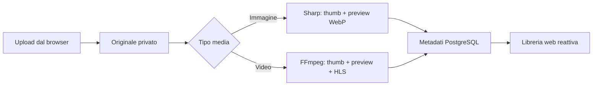

# Frameo

Frameo è un media manager privato, veloce e dockerizzabile per caricare, elaborare,
catalogare e riprodurre foto e video dal browser.

## Cosa include

- UI responsive per desktop, tablet e mobile
- upload drag-and-drop in streaming, senza tenere l'intero file in memoria
- Download center Telegram e pagine web, con coda persistente, avanzamento e ripresa dei file parziali
- thumbnail e preview WebP per le immagini tramite Sharp
- thumbnail, clip preview e playlist HLS per i video tramite FFmpeg
- streaming HTTP con supporto `Range` per seek e riproduzione progressiva
- PostgreSQL + Prisma per media, persone, tag, gruppi e job di elaborazione
- filtri avanzati combinabili per persone, tag, gruppi, date, durata, risoluzione,
  stato, preferiti, marker e duplicati
- marker temporali e player Highlights infinito sulla vista filtrata, con ritorno
  immediato al video sorgente
- Frame Lab per scorrere i video a passi di 1 o 10 fotogrammi, leggere timecode e
  FPS reali e salvare screenshot PNG alla risoluzione sorgente
- anteprima video automatica al passaggio del mouse
- gestione amministrativa delle cartelle scansionate e della destinazione upload
- coda manuale per generare o rigenerare miniature e clip di anteprima
- rilevamento duplicati esatti SHA-256 e somiglianze visuali tramite dHash
- editor FFmpeg non distruttivo per tagliare, dividere e unire video
- utenti, ruoli e regole ALLOW/DENY per media, persone, tag e gruppi
- rinomina fisica e riorganizzazione sicura degli originali in cartelle reali
- catalogazione rapida, selezione multipla, ricerca e pannello dettagli
- modalità demo automatica quando non è configurato un database
- immagine Docker singola più PostgreSQL in Docker Compose

## Galleria su Fire TV Stick

La pagina `/tv` contiene solo la galleria, con interfaccia scura, miniature grandi,
filtri Tutti / Video / Foto / Preferiti e 24 contenuti per pagina. È disponibile
anche dal collegamento **Galleria TV** nella barra laterale del sito.

1. Apri Amazon Silk sulla Fire TV Stick.
2. Usa l'indirizzo del server Frameo seguito da `/tv`, per esempio
   `http://192.168.1.50:3000/tv`. Fire Stick e server devono essere sulla stessa
   rete, con la porta del sito raggiungibile. `localhost` sulla TV indica la TV,
   non il computer che ospita Frameo.
3. Salva l'indirizzo nei preferiti di Silk.

Le frecce spostano la selezione e OK apre foto e video nel visualizzatore a tutta
pagina. Indietro chiude il visualizzatore; sono disponibili anche pulsanti grandi
per chiudere e passare al contenuto precedente o successivo della pagina corrente.
Per i video, premi **Riproduci**: il telecomando può anche controllare play/pausa
e avanzamento/riavvolgimento di 10 secondi quando Silk inoltra questi tasti al sito.
I pulsanti a schermo restano utilizzabili anche con il puntatore di Silk.

Per scegliere cosa mostrare sulla TV, apri un contenuto nella libreria e attiva
**Mostra nella Galleria TV** nel pannello dei dettagli. Puoi anche selezionare più
foto e video e usare **Aggiungi alla TV** oppure **Rimuovi dalla TV** nella barra
delle azioni. La selezione è salvata nel database e condivisa fra i dispositivi;
ricarica `/tv` sulla Fire Stick per vedere gli aggiornamenti. I contenuti nuovi
sono esclusi dalla TV finché non li selezioni. I preferiti restano indipendenti.

La vista usa le API e le regole di accesso esistenti e mostra solo contenuti pronti
con **Mostra nella Galleria TV** attivo.
Non include caricamento, modifica o gestione della libreria. I video usano la copia
MP4 compatibile già preparata, quando disponibile, oppure il file originale;
se il formato non è riproducibile, prepara **Video compatibile** dalla libreria sul
computer e riapri il contenuto sulla TV. Senza database viene mostrata la galleria
demo, in cui i video sono anteprime statiche e la selezione TV viene salvata solo
nel browser usato per sceglierla, senza sincronizzazione con altri dispositivi.

La navigazione può essere verificata anche da computer con frecce, Invio e Escape.
La riproduzione e i tasti effettivamente inoltrati da Silk vanno verificati sulla
Fire Stick utilizzata.

## Avvio rapido con Docker

```bash
docker compose up --build
```

Apri [http://localhost:3000](http://localhost:3000).

I file originali e derivati restano nel volume `frameo_media`; il database è nel
volume `frameo_postgres`.

Al primo avvio il database è vuoto: Frameo apre la pagina **Utenti & accessi**
per creare il primo amministratore con nome ed email reali. I dati dimostrativi
non vengono caricati a meno di impostare esplicitamente `FRAMEO_SEED_DEMO=true`.

Il Compose locale applica un profilo prudente per computer poco potenti: un core
per Frameo, mezzo core per PostgreSQL e limiti di memoria configurabili tramite
variabili d'ambiente.

## Release Docker

Il workflow in `.github/workflows/release-container.yml` viene eseguito quando
viene pubblicato un tag semantico `vX.Y.Z`. La pipeline:

- costruisce l'immagine per `linux/amd64` e `linux/arm64`;
- pubblica i tag versione e `latest` su GitHub Container Registry;
- crea automaticamente la GitHub Release;
- allega l'immagine AMD64 compressa per installazioni offline;
- allega un bundle Compose già configurato per hardware debole;
- pubblica `SHA256SUMS` per verificare i download.

Per creare una release:

```bash
git tag v0.1.0
git push github v0.1.0
```

Il PC finale non deve compilare il progetto: può scaricare l'immagine da GHCR o
caricare l'archivio Docker allegato alla release. L'immagine runtime contiene
soltanto l'app standalone e gli strumenti Prisma necessari all'avvio, escludendo
le dipendenze di sviluppo. Le istruzioni distribuite agli utenti sono in
`deploy/INSTALL.md`.

## Sviluppo locale

Prerequisiti: Node 24+, PostgreSQL e FFmpeg disponibili nel `PATH`.

```bash
npm install
copy .env.example .env
npm run db:push
npm run db:seed
npm run dev
```

Per provare soltanto l'interfaccia senza PostgreSQL:

```bash
$env:DEMO_MODE="true"
npm run dev
```

## Pipeline media



Gli originali non vengono modificati durante l'elaborazione. Ogni derivato è salvato in
`storage/derived/<media-id>` e può essere rigenerato senza perdita.
Con Docker, `FRAMEO_STORAGE_HOST_PATH` può puntare a una cartella assoluta su un
disco esterno: in quel caso originali, derivati e configurazione della libreria
vengono conservati lì invece che nel volume Docker sul disco di sistema.

## Download da Telegram

Apri **Download center** dalla barra laterale, inserisci `api_id` e `api_hash`
creati su [my.telegram.org/apps](https://my.telegram.org/apps), quindi completa il
login con il codice Telegram e l'eventuale password 2FA. Dopo il primo accesso la
sessione resta nello storage privato di Frameo e non deve essere reinserita.

La pagina accetta link a singoli messaggi `t.me`, inclusi gruppi e canali privati
già accessibili all'account. I download interrotti restano come file `.part`,
riprendono automaticamente al riavvio e, una volta completi, entrano nella stessa
pipeline di indicizzazione degli upload manuali.

## Download da una pagina web

Nella stessa pagina, usa **Pagina web** e incolla l'URL pubblico di una pagina che
contiene un video oppure il link diretto al file. Frameo usa `yt-dlp` per trovare
e scaricare un singolo video, mostra l'avanzamento e lo aggiunge alla libreria.
La coda riprende dopo un riavvio. Gli URL locali/privati sono rifiutati e la
dimensione massima segue `MAX_UPLOAD_BYTES` (5 GB per impostazione predefinita).
Il risultato dipende dal sito: non sono supportati video protetti da DRM o che
richiedono cookie, accesso privato o abbonamenti.

Per le cartelle pubbliche Gofile con un solo video, Frameo usa il normale
pulsante di download del sito in un browser isolato, senza richiedere un account Premium.
Per questa modalità il container può usare circa 400 MB di RAM aggiuntivi durante
il trasferimento; si consiglia `FRAMEO_MEMORY_LIMIT=1024m` o superiore.

Gli album pubblici Bunkr vengono suddivisi in download separati per ogni video
supportato; sono accettati anche i link alle pagine dei singoli file Bunkr.
Frameo usa l'URL video pubblico firmato dal player, con HTTPS e ripresa dei file
parziali. Non disattiva la verifica TLS e non usa il link `dl.bunkr.cr` se il
certificato non è valido.

Una libreria host può essere montata in lettura/scrittura con
`deploy/docker-compose.external.yml`. La pagina **Gestione libreria** permette di
limitare la scansione a specifiche sottocartelle, vedere i conteggi reali
dell'indice e avviare in background la generazione delle anteprime mancanti. Gli
upload restano nello storage gestito da Frameo, nella cartella relativa scelta
dall'amministratore. Un amministratore può eliminare definitivamente un media:
una conferma esplicita rimuove originale, derivati e record del catalogo.

Gli screenshot estratti dai video diventano normali media della libreria: restano
collegati al video e al timecode sorgente, ereditano persone, tag e gruppi e
seguono quindi le stesse regole di visibilità.

Le operazioni dell'editor generano nuovi originali sotto `storage/edited`. Lo
spostamento fisico è invece intenzionalmente distruttivo sul vecchio path: richiede
la conferma testuale `SPOSTA`, verifica che i path restino nello storage gestito,
evita collisioni e ripristina il file se l'aggiornamento del database fallisce.

## Modello dati

- `MediaAsset`: originale, derivati, stato, metadati tecnici, FPS e relazione
  sorgente/screenshot
- `Person` / `MediaPerson`: persone e regioni facciali opzionali
- `Tag` / `MediaTag`: tassonomia libera many-to-many
- `Group` / `GroupMedia`: raccolte ordinate
- `ProcessingJob`: avanzamento, operazione ed eventuale errore
- `HighlightMarker`: intervalli temporali riproducibili nel feed Highlights
- `DuplicateMatch`: corrispondenze esatte o percettive e stato di revisione
- `AppUser` / `AccessRule`: ruoli e ACL con precedenza delle regole DENY
- `EditProject` / `EditSegment`: montaggi non distruttivi e sorgenti ordinate
- `FileOperation`: audit degli spostamenti, copie e rinomine

## API principali

- `GET /api/media` — elenco media e filtri avanzati server-side
- `POST /api/media` — upload multipart di un file
- `GET /api/media/:id` — dettaglio completo
- `PATCH /api/media/:id` — titolo, note, preferito, tag, persone e gruppi
- `GET|POST /api/media/:id/markers` — marker dei momenti salienti
- `GET|POST /api/media/:id/screenshots` — elenco e cattura precisa dei fotogrammi
- `GET /api/highlights` — feed filtrato dei marker in evidenza
- `GET|POST /api/duplicates` — revisione e nuova scansione duplicati
- `GET|POST /api/editor` — progetti di taglio, split e merge
- `POST /api/files/rename` — rinomina del file originale gestito
- `POST /api/files/organize` — anteprima ed esecuzione MOVE/COPY
- `GET|POST /api/users` — gestione utenti
- `PATCH /api/users/:id` — ruolo, stato e ACL
- `GET /api/stream/*` — originali, preview e segmenti HLS con byte range
- `GET /api/health` — salute applicazione e database

## Identità e permessi

Il livello di autorizzazione è applicato a liste, dettagli, marker, editor e file
streamati. L'identità corrente viene letta dal cookie `frameo_user` oppure
dall'header `x-frameo-user-id`; senza identità esplicita viene usato il primo
amministratore attivo. In produzione l'header deve essere impostato da un reverse
proxy di autenticazione fidato, che rimuova ogni valore fornito dal client.

Gli amministratori vedono e gestiscono tutto. I curatori possono modificare i
contenuti visibili; i visualizzatori non vedono nulla finché non ricevono almeno
una regola `ALLOW`. Una regola `DENY` prevale sempre su qualsiasi permesso.

## Scelte architetturali

Frameo parte volutamente come servizio unico Next.js: UI, API e worker condividono
tipi e deploy, mantenendo bassi consumo e complessità. Per carichi elevati, la
funzione `processMediaAsset` è già isolata e può essere spostata in un worker
dedicato con Redis/BullMQ e storage S3 compatibile senza cambiare il modello dati
o il client.
